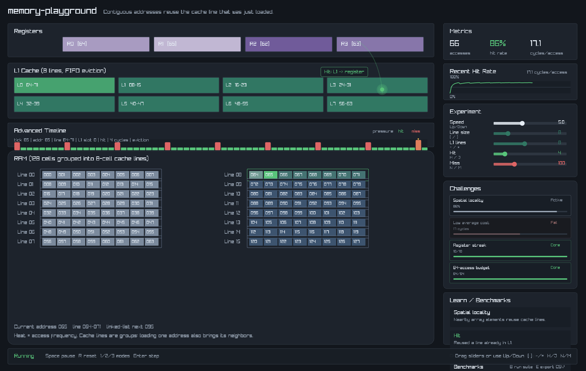

# Memory Playground

Interactive C++ simulation and visualization platform for exploring cache behavior, memory locality, and performance-oriented access patterns.

The project focuses on deterministic simulation, instrumentation, and real-time visualization of memory system behavior.

## Highlights

- Deterministic memory simulation
- Cache line loading and eviction tracking
- Structured instrumentation pipeline
- Timeline-based trace analysis
- Heatmap and cache pressure visualization
- Reproducible benchmark scenarios
- Modular simulation/rendering separation

## Architecture

Core systems:

- `SimulationState`
- `MetricsCollector`
- `TraceEvent`
- `ScenarioDefinition`
- `SimulationRun`
- `BenchmarkRunner`

The simulation layer is intentionally decoupled from rendering to support:

- deterministic execution
- offline analysis
- future replay tooling
- headless benchmarking

## Benchmark Scenarios

Included scenarios:

- sequential access
- random access
- stride access
- hot-set reuse
- cache thrashing

## Documentation

- [Architecture](docs/architecture.md)
- [Instrumentation](docs/instrumentation.md)
- [Roadmap](docs/roadmap.md)
